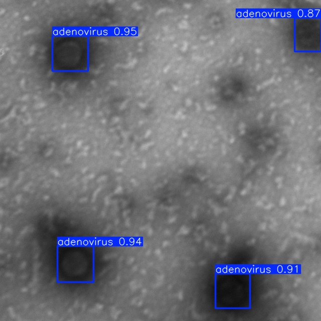
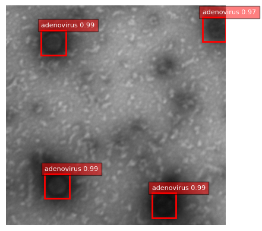
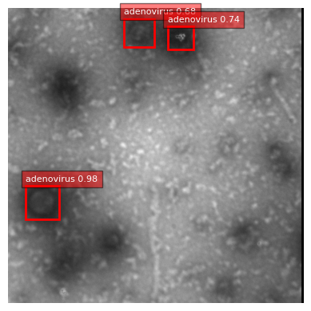

# Evaluation — Test set with ground truth

Side-by-side comparison of YOLO and DETR predictions on adenovirus detection (mini-TEM images).

| YOLO | DETR |
|------|------|
|  |  |
|  |  |
|  |  |
|  |  |
