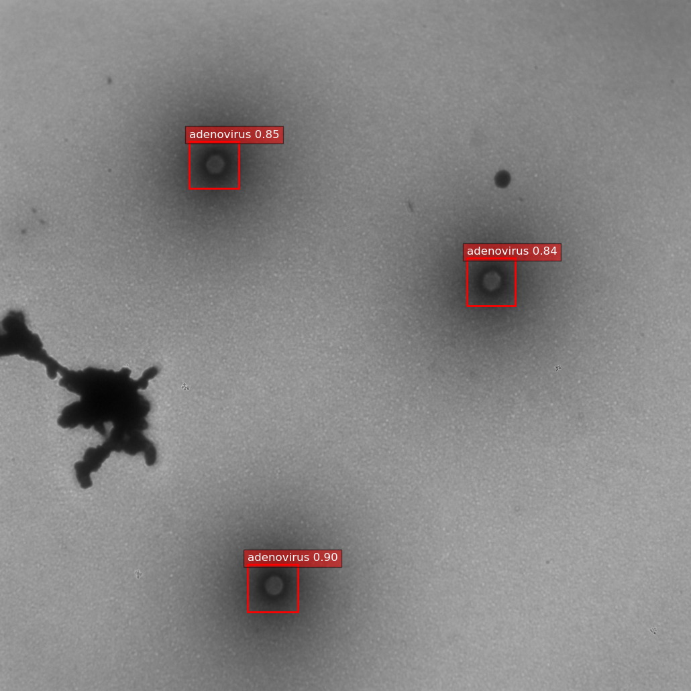
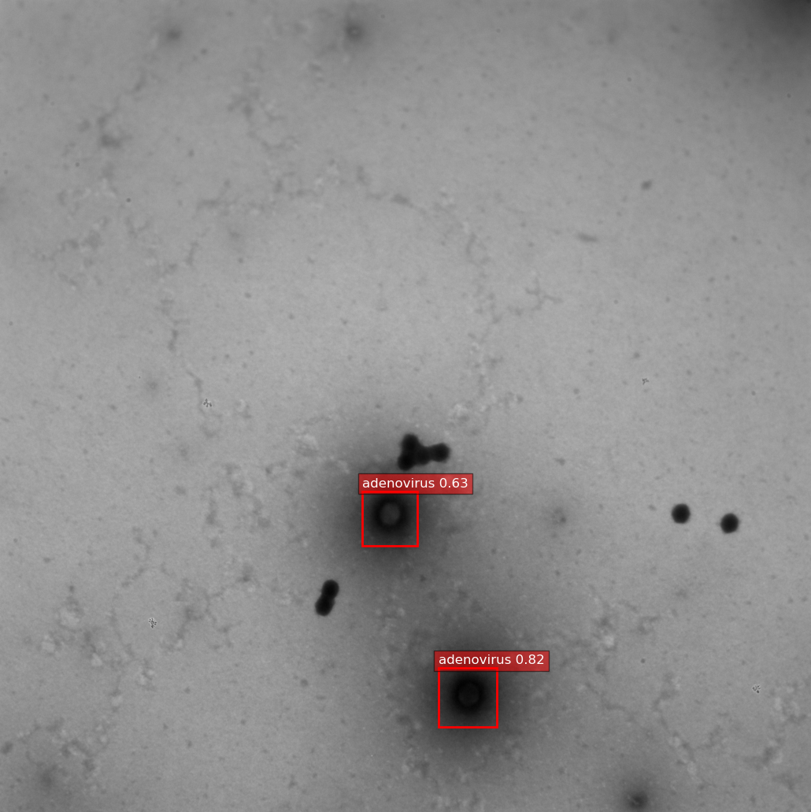
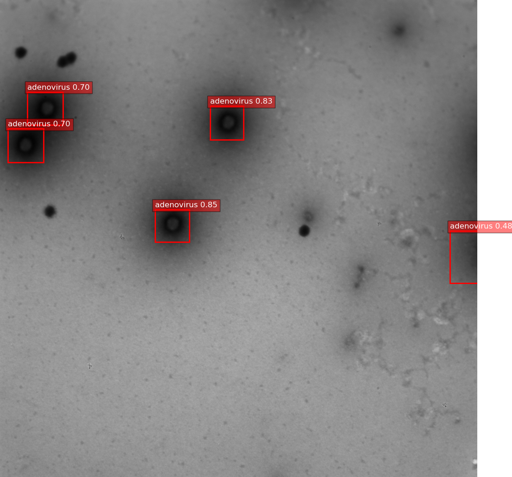
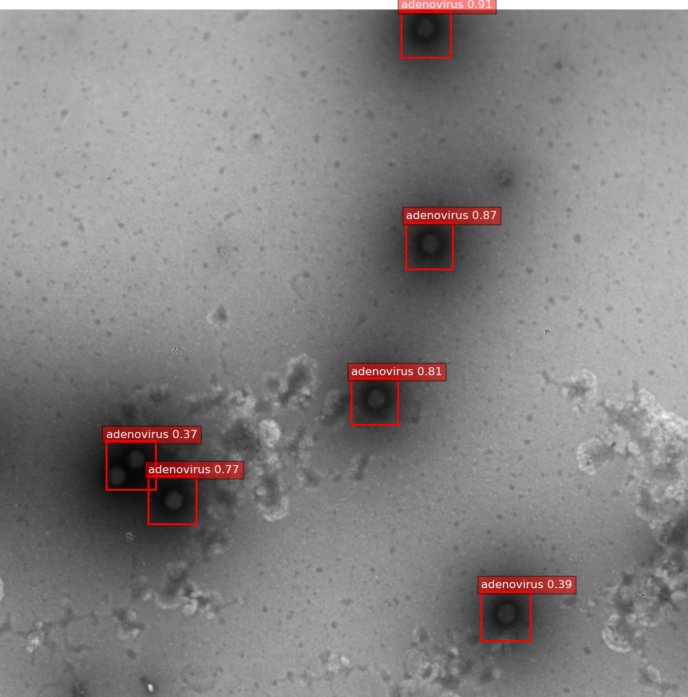

# Inference — Test set without ground truth

Qualitative comparison on unlabeled adenovirus mini-TEM images.

| YOLO | DETR |
|------|------|
|  |  |
|  |  |
|  |  |
|  |  |

| YOLO | DETR |
|------|------|
|  |  |
|  |  |
|  |  |
|  |  |

